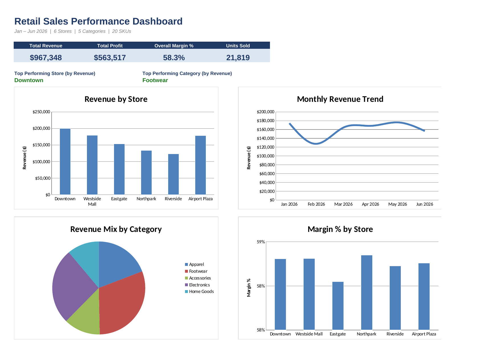

# 01 · Retail Sales Performance Dashboard

**Business problem:** A regional manager overseeing 6 stores and 20 SKUs needs
a single, always-current view of sales, profit, and margin — without manually
pulling numbers from raw POS exports every week.

## File

[`sales_dashboard.xlsx`](./sales_dashboard.xlsx)

## Excel techniques used

- `SUMIFS` / `COUNTIFS` / `AVERAGEIFS` for conditional aggregation across a
  4,300+ row transaction log
- Structured Excel Table (`RawData`) as a single sortable/filterable source of truth
- Formula-driven summary tables by Store, Category, and Month — no pasted totals
- Conditional formatting (color scales) to flag margin outliers
- A KPI-card + chart dashboard wired entirely to live formulas

## Sheet guide

| Sheet | Purpose |
|---|---|
| `Dashboard` | One-page KPI cards + 4 charts — start here |
| `Raw Data` | 4,339-row synthetic transaction log, Jan–Jun 2026 |
| `Store Summary` | Revenue, units, profit, margin % by store |
| `Category Summary` | Revenue, units, profit, margin % by category |
| `Monthly Trend` | Revenue, units, profit by month |

## Key insights found

*(from the synthetic dataset — replace with real findings once live POS data is loaded)*

- **Downtown** is the top-performing store by revenue, running roughly
  12% ahead of the next-closest location.
- **Footwear** is the largest revenue category, driven by a spring/early-summer
  seasonal lift built into the sample data.
- Margin % is fairly consistent across stores (~58%), suggesting store-level
  performance gaps are driven by **volume**, not pricing/cost differences —
  worth checking against real data.

## Data note

`Raw Data` is a synthetic dataset (seeded random generation) covering 6 stores,
5 categories, and 20 SKUs with built-in seasonality and weekend traffic lift.
It's for demonstrating the technique, not real sales figures. Swap in a real
POS export with the same column layout (`Date, Store Code, Store, Region,
Category, SKU, Product, Units Sold, Unit Price, Unit Cost`) and every formula
recalculates automatically.

## Screenshot

