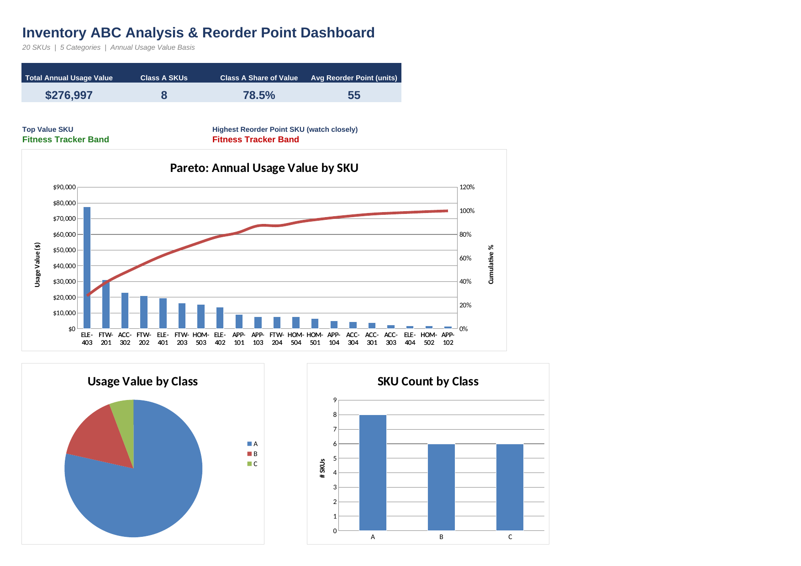

# 02 · Retail Inventory Optimization & Replenishment Analytics

**Business problem:** Managing every SKU with the same inventory policy can
lead to excess inventory on low-value products and stockout risk on important
or unpredictable products. This project uses inventory value, demand
variability, lead time, and replenishment calculations to support more
targeted inventory decisions.

## Objective

Build an Excel-based inventory analytics model that helps a retailer:

- Identify high-value inventory items
- Measure demand predictability
- Segment SKUs using ABC and XYZ analysis
- Calculate safety stock and reorder points
- Calculate Economic Order Quantity (EOQ)
- Support differentiated inventory-management decisions

## Workbook

[`inventory_optimization.xlsx`](./inventory_optimization.xlsx)

## Analytical Model

```text
SKU Data
   ↓
Centralized Assumptions
   ↓
ABC Analysis ──────┐
                   ├──→ Inventory Decision Support
XYZ Analysis ──────┘
   ↓
Reorder Point
   ↓
Safety Stock
   ↓
EOQ

# ABC Analysis

ABC classification is based on annual inventory usage value.

**Annual Usage Value = Unit Cost × Annual Units Sold**

Current thresholds:

- **A:** cumulative value share ≤ 80%
- **B:** cumulative value share > 80% and ≤ 95%
- **C:** cumulative value share > 95%

The thresholds are stored centrally on the Assumptions sheet.

## Current ABC Results

| Class | SKU Count | Annual Usage Value | Value Share |
|-------|-----------|---------------------|--------------|
| A | 8 | $217,451.00 | 78.50% |
| B | 6 | $43,744.00 | 15.79% |
| C | 6 | $15,802.00 | 5.70% |
| **Total** | **20** | **$276,997.00** | **100.00%** |

# XYZ Analysis

XYZ analysis measures demand variability using the Coefficient of Variation.

**CV = Demand Std Dev ÷ Avg Daily Demand**

Current thresholds:

- **X:** CV ≤ 50%
- **Y:** CV > 50% and ≤ 100%
- **Z:** CV > 100%

The thresholds are stored centrally on the Assumptions sheet.

## Current XYZ Results

| Class | SKU Count |
|-------|-----------|
| X | 16 |
| Y | 4 |
| Z | 0 |
| **Total** | **20** |

The current dataset contains no Z-class SKUs because no SKU has a CV above the current Z threshold.

## ABC-XYZ Matrix

## Inventory Policy

The ABC-XYZ segments are mapped to differentiated inventory-management
policies based on financial importance and demand predictability.

| Segment | Service Level | Review Frequency | Inventory Control |
|---|---:|---|---|
| AX | 99% | Daily | Very High |
| AY | 99% | Daily | Very High |
| AZ | 99% | Daily | Very High |
| BX | 95% | Weekly | High |
| BY | 95% | Weekly | High |
| BZ | 95% | Weekly | High |
| CX | 90% | Monthly | Standard |
| CY | 90% | Weekly | Standard |
| CZ | 90% | Weekly | Standard |

The policy is maintained centrally on the `Inventory Policy` sheet and is
automatically assigned to each SKU using `INDEX` and `MATCH`.

The current dataset contains AX, AY, BX, CX, and CY segments. Z-class
segments are included in the policy table for future datasets but currently
contain no SKUs.

### Policy-Driven Replenishment

The replenishment model now follows:

```text
ABC + XYZ
   ↓
ABC-XYZ Segment
   ↓
Inventory Policy
   ↓
Service Level
   ↓
Z Score
   ↓
Safety Stock
   ↓
Reorder Point

# Reorder Point

**Reorder Point = Avg Daily Demand × Lead Time + Safety Stock**

The reorder point estimates the inventory level at which replenishment should be triggered.

## Safety Stock

**Safety Stock = Z × Demand Std Dev × √Lead Time**

Service-level and Z-score assumptions are centralized on the Assumptions sheet.

# Economic Order Quantity

**EOQ = √(2 × Annual Demand × Order Cost ÷ Holding Cost)**

EOQ estimates an order quantity that balances ordering and holding costs.

# Excel Techniques

- SUMPRODUCT
- RANK
- SUMIF
- COUNTIF
- COUNTIFS
- INDEX
- MATCH
- IF
- IFERROR
- Coefficient of Variation
- Conditional formatting
- Centralized assumptions
- Dynamic classification
- Formula-based validation

# Validation

The workbook includes checks to confirm that:

- ABC class counts reconcile to the total SKU population
- ABC value shares reconcile to 100%
- XYZ class counts reconcile to the total SKU population

These checks help ensure the model remains internally consistent when assumptions or source data change.

# Sheet Guide

| Sheet | Purpose |
|-------|---------|
| Dashboard | Executive inventory KPIs and visual summary |
| SKU Data | Source SKU and inventory inputs |
| Assumptions | Centralized classification and service-level assumptions |
| ABC Analysis | Annual usage value and ABC classification |
| XYZ Analysis | Demand variability and XYZ classification |
| Reorder Point Model | Safety stock, reorder point, and EOQ calculations |

# Business Insight

The current ABC analysis shows that 8 of 20 SKUs account for 78.50% of annual usage value, demonstrating that inventory control should not treat all SKUs equally.

The XYZ analysis adds a second dimension by identifying whether demand is relatively stable or variable.

Together, ABC and XYZ provide a stronger foundation for differentiated inventory policies.

# Data Note

The dataset is synthetic and created for learning and portfolio purposes.

It does not represent real retailer, supplier, customer, or POS data.

The workbook uses live formulas so that changes to the underlying inputs or centralized assumptions flow through the analytical model.

# Screenshot


## Portfolio value

This project demonstrates practical Excel skills for retail inventory analytics, including:

- Inventory segmentation
- ABC analysis
- Demand variability analysis
- Replenishment calculations
- Safety-stock modeling
- Reorder-point modeling
- EOQ analysis
- Dynamic Excel formulas
- Centralized model assumptions
- Analytical validation
- Retail decision-support thinking

The project is being progressively upgraded from a basic ABC/reorder-point model into a broader **retail inventory optimization and replenishment analytics solution**.
```
