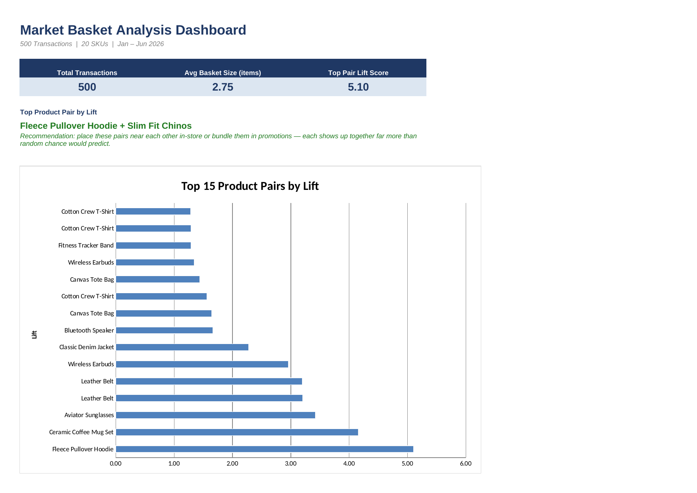

# 03 · Customer Basket & Market Basket Analysis

**Business problem:** Which products get bought together? Knowing this guides
store layout (place affinity items near each other), cross-merchandising
displays, bundle promotions, and "customers also bought" recommendations.

## File

[`market_basket_analysis.xlsx`](./market_basket_analysis.xlsx)

## Excel techniques used

- `COUNTIFS` to reshape long-format transaction lines into a wide product-purchase matrix
- `SUMPRODUCT` to compute a full product × product co-occurrence matrix
- Pivot-style cross-tab for product-pair frequency
- Market basket metrics: Support, Confidence, and Lift
- Conditional formatting to heat-map the co-occurrence matrix
- Dashboard chart ranking the strongest product-pair recommendations

## Sheet guide

| Sheet | Purpose |
|---|---|
| `Dashboard` | KPIs + top product-pair recommendations chart — start here |
| `Transactions` | 1,377 raw line items across 500 baskets, Jan–Jun 2026 |
| `Transaction-Product Matrix` | Reshaped 500 × 20 purchase-indicator matrix |
| `Co-occurrence Matrix` | 20 × 20 heat-mapped pair-frequency cross-tab |
| `Association Rules` | Top 30 pairs ranked by Lift, with Support/Confidence/Lift |

## Method

- **Transactions** holds raw POS line items — one row per SKU purchased within
  a transaction, the format a POS system actually exports.
- **Transaction-Product Matrix** reshapes that into wide format: one row per
  transaction, one column per SKU, 1 if purchased else 0, built with
  `COUNTIFS`. In a live pipeline this reshaping step is a great fit for Power
  Query's Pivot Column feature; it's done here with formulas so the workbook
  needs no external data connections to open and recalculate correctly.
- **Co-occurrence Matrix** computes, for every SKU pair, how many
  transactions contained both — a `SUMPRODUCT` of the two product columns
  from the matrix above. (Diagonal cells show a single item's own frequency,
  not a real pair — ignore them when reading co-purchase strength.)
- **Association Rules** translates raw co-occurrence into decision-ready
  metrics:
  - **Support** — how common the pair is across all baskets
  - **Confidence (A→B)** — P(buy B | bought A)
  - **Lift** — how much more likely B is when A is in the basket, vs. buying
    B on its own. Lift > 1 means a real positive association, not just two
    popular items showing up together by chance.

## Key insights found

*(from the synthetic dataset — replace with real findings once live POS data is loaded)*

- **Fleece Pullover Hoodie + Slim Fit Chinos** is the strongest pair
  (Lift ≈ 5.1) — a clear casual-outfit bundle opportunity.
- **Ceramic Coffee Mug Set + Scented Candle** (Lift ≈ 4.2) is a natural
  home-gift bundle, and appears in ~9% of all baskets.
- **Aviator Sunglasses + Running Sneakers** (Lift ≈ 3.4) and **Leather Belt +
  Leather Ankle Boot** (Lift ≈ 3.2) point to an "athleisure" and a
  "leather goods" cross-merchandising cluster respectively.
- **Wireless Earbuds + Phone Charging Cable** (Lift ≈ 3.0) is the most
  *common* strong pair — it shows up in 14% of all baskets — making it the
  best candidate for an always-on register display or auto-suggested add-on.

## Data note

`Transactions` is a synthetic dataset (seeded random generation), with six
product affinities intentionally built into the basket-generation logic so
the analysis has real patterns to find — see `gen_basket_data.py`. Product
master is shared with `01-sales-dashboard` and `02-inventory-abc-analysis`
for portfolio continuity. Swap in a real POS transaction export with the
same `Transaction ID / SKU` columns and every downstream sheet recalculates.

## Screenshot

<<<<<<< HEAD

=======
*(add a screenshot or GIF of the Dashboard sheet here)*
>>>>>>> d6edb06c3802f9db7265119b6b7630d5cd1e44e6
