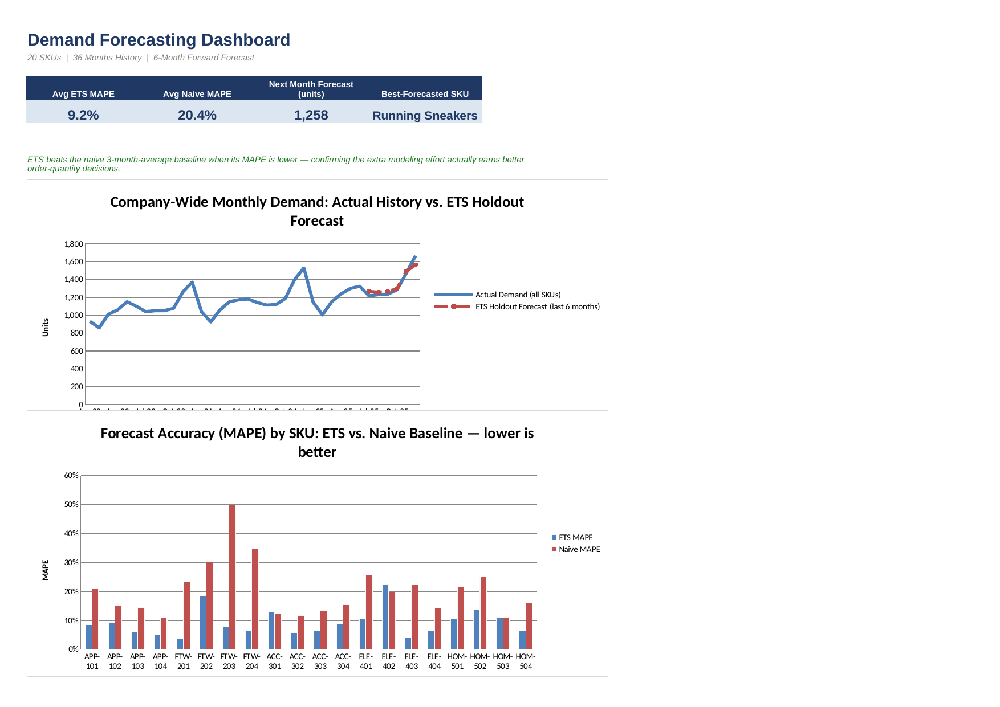

# 04 · Demand Forecasting for Reordering

**Business problem:** Ordering too little means stockouts; ordering too much
ties up cash in inventory. Predicting next month's demand per SKU —
accounting for seasonality and trend, not just last month's number — lets
buyers set order quantities with real confidence instead of a gut-feel guess.

## File

[`demand_forecasting.xlsx`](./demand_forecasting.xlsx)

## Excel techniques used

- `FORECAST.ETS` for exponential-smoothing forecasts that account for trend and seasonality
- A 3-month moving average as a simple naive baseline for comparison
- Seasonality built into, and recovered from, 36 months of monthly history
- MAPE (Mean Absolute Percentage Error) back-tested on a 6-month holdout,
  comparing `FORECAST.ETS` against the naive baseline
- Conditional formatting to flag which SKUs forecast least reliably

## Sheet guide

| Sheet | Purpose |
|---|---|
| `Dashboard` | Actual-vs-forecast trend chart, MAPE comparison, next-month order signal |
| `Historical Demand` | 36-month actuals per SKU, Jan-2023–Dec-2025 (blue = editable input) |
| `Moving Average` | 3-month trailing moving average per SKU, all 36 months |
| `Forecast Validation` | 6-month holdout back-test: ETS vs. naive MAPE per SKU |
| `Forward Forecast` | Live 6-month forecast (Jan–Jun 2026) for reordering |

## Method

- **Forecast Validation** trains `FORECAST.ETS` on the first 30 months only
  (Jan-2023–Jun-2025) and forecasts the last 6 months (Jul–Dec 2025) blind,
  then compares those forecasts to what actually happened. This is the
  honest way to check forecast accuracy — testing on data the model has
  already seen would flatter the result. A naive 3-month moving-average
  baseline is back-tested the same way for a fair comparison.
- 30 months of training data is used deliberately — `FORECAST.ETS` needs at
  least two full seasonal cycles (24 months, for monthly/yearly seasonality)
  to detect the seasonal pattern reliably. An earlier version of this model
  trained on only 18 months and the seasonality detection was unstable;
  extending history to 36 months (and training on 30) fixed it.
- **Forward Forecast** retrains on the full 36 months (nothing held back)
  and forecasts the next 6 months, Jan–Jun 2026 — the numbers a buyer would
  actually use to plan orders. Recommended order quantity = next month's
  forecast + a 15% buffer (editable).
- **MAPE** = average, across the 6 holdout months, of `|Actual - Forecast| / Actual`.
  Lower is better; under ~15–20% is generally considered a usable forecast
  for reordering, though the right bar depends on the business.

## Key insights found

*(from the synthetic dataset — replace with real findings once live sales data is loaded)*

- **ETS clearly beats the naive baseline**: average MAPE across all 20 SKUs
  is **9.2% for `FORECAST.ETS` vs. 20.4% for the 3-month moving average** —
  more than twice as accurate, because ETS actually models the seasonal
  swing instead of just averaging recent months flat.
- The gap is largest for strongly seasonal SKUs — e.g. **Leather Ankle Boot**
  (ETS 7.7% vs. naive 49.8%) and **Slide Sandals** (ETS 6.6% vs. naive
  34.7%) — where a flat moving average badly misjudges a season turn that
  ETS anticipates.
- A couple of SKUs (**Bluetooth Speaker**, **Leather Belt**) are where ETS's
  edge is smallest or slightly behind naive — worth a closer look before
  fully trusting the model for those two, or gathering more history.
- Total company-wide forecast demand for **January 2026 is ~1,258 units**,
  the KPI a planner would use for aggregate purchasing/budget conversations.

## Data note

`Historical Demand` is a synthetic dataset (seeded random generation) with
category-level seasonality and a per-SKU compounding growth trend
intentionally built in — see `gen_demand_data.py`. Product master is shared
with the earlier projects in this repo for portfolio continuity. Swap in
real monthly sales history with the same SKU/month layout and every
downstream sheet — moving average, back-test, and forward forecast —
recalculates automatically.

## Screenshot

<<<<<<< HEAD

=======
*(add a screenshot or GIF of the Dashboard sheet here)*
>>>>>>> d6edb06c3802f9db7265119b6b7630d5cd1e44e6
