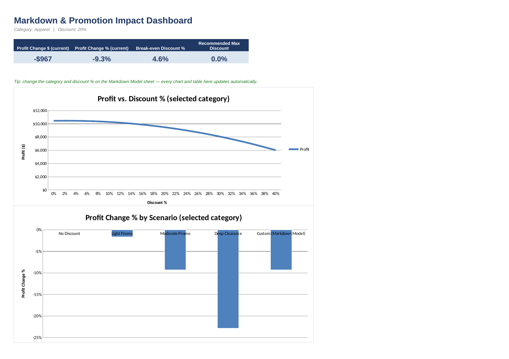

# 05 · Markdown & Promotion Impact Simulator

**Business problem:** Should a category get a 10%, 20%, or 30% discount —
and what does each option do to margin? A markdown grows units sold (demand
rises as price drops) but shrinks the margin on every unit. Whether a given
discount helps or hurts total profit depends on how price-sensitive that
category's customers are.

## File

[`markdown_promotion_simulator.xlsx`](./markdown_promotion_simulator.xlsx)

## Excel techniques used

- One-variable sensitivity table: profit/revenue across a range of discount levels
- Two-variable sensitivity grid: discount level × category, profit impact at every combination
- Break-even discount solved algebraically (a closed-form Goal Seek)
- Scenario comparison table (a Scenario-Manager-style summary) across named promo options
- Data validation dropdown to switch the active category
- Sensitivity charts and conditional-formatting heat maps

## Sheet guide

| Sheet | Purpose |
|---|---|
| `Dashboard` | KPIs + sensitivity chart + scenario chart — start here |
| `Markdown Model` | The live what-if calculator: pick a category and a discount % |
| `Category Assumptions` | Price, cost, volume, and elasticity per category (blue = editable) |
| `One-Variable Sensitivity` | Profit/Revenue across 0–40% discount, for the selected category |
| `Two-Variable Grid` | Profit Change % across discount × category, all at once |
| `Scenario Comparison` | Named promo scenarios compared side by side |

## The model

- **Price elasticity of demand (E)** says how much unit volume rises for a
  given % price cut: `%ΔVolume = E × %ΔPrice-cut`. E = 2.0 means a 10% price
  cut lifts volume ~20%. Elasticity differs by category — Footwear
  customers are assumed far more price-sensitive than Electronics buyers.
- For a discount `d`: `New Price = Price × (1-d)`; `New Volume = Volume × (1 + E×d)`;
  `New Profit = New Volume × (New Price - Cost)`. Every other sheet is built from this one formula.
- **Break-even Discount %** is the discount at which New Profit equals
  Baseline Profit — deeper than this and the promotion actively loses money,
  even though revenue is rising. It has a clean closed form:
  **Break-even Discount = Margin% − 1/Elasticity**. This is the algebraic
  equivalent of using Excel's Goal Seek to find the discount % that zeroes
  out Profit Change (`Data > What-If Analysis > Goal Seek`, set Profit
  Change to 0 by changing Discount %, lands on the same number).

### A note on Data Tables & Scenario Manager

Excel's `What-If Analysis > Data Table` feature and Scenario Manager both
work by temporarily substituting values into a live model cell — they're
interactive tools, not stored formulas, so they don't travel well as a
portable file. The `One-Variable Sensitivity`, `Two-Variable Grid`, and
`Scenario Comparison` sheets reproduce exactly what those tools would
output, but as ordinary formulas that recalculate on open in any
spreadsheet program — no macros, no manual re-run needed. In live Excel you
could build the same grids using `Data > What-If Analysis > Data Table`
pointed at `Markdown Model`'s Discount % and Category cells.

## Key insights found

*(from the model's illustrative assumptions — replace with real elasticity
estimates once available)*

- **Three of five categories have a *negative* break-even discount**
  (Accessories −2.4%, Electronics −18.5%) — meaning, under these assumed
  elasticities, *any* markdown loses money for them. Their margin cushion
  isn't big enough, or their customers aren't price-sensitive enough, to
  make a discount pay for itself.
- **Footwear tolerates the deepest discount** (break-even ≈ 12.7%) thanks to
  the highest assumed elasticity (2.2) in the set — Footwear customers are
  assumed to respond most strongly to a price cut.
- At a flat 20% "Moderate Promo" scenario, Apparel's profit falls ~9.3% even
  though revenue rises — a textbook case of a promotion that looks good on
  the top line and bad on the bottom line.
- **Takeaway for buyers:** check the Break-even Discount % on `Category
  Assumptions` before setting a markdown — it's a fast sanity check that
  the depth of a planned promotion doesn't quietly erase its own profit.

## Data note

Category price/cost are averaged from the shared product master used
throughout this repo; baseline monthly volume and price elasticity are
illustrative assumptions, not measured figures — see `Category Assumptions`
(blue cells). Replace them with real numbers (ideally elasticity estimated
from actual past markdown performance) and every sheet recalculates.

## Screenshot

<<<<<<< HEAD

=======
*(add a screenshot or GIF of the Dashboard sheet here)*
>>>>>>> d6edb06c3802f9db7265119b6b7630d5cd1e44e6
