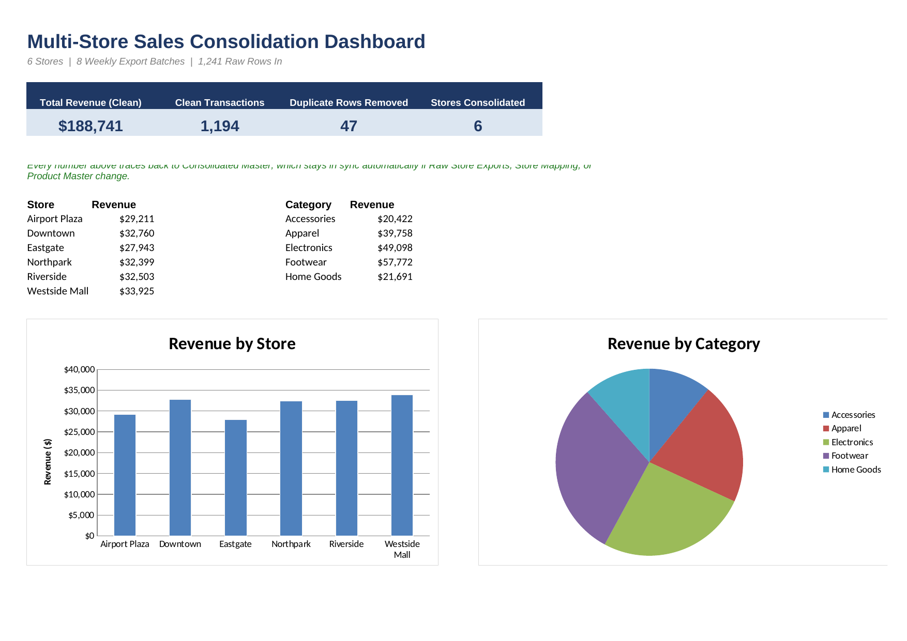

# 06 · Multi-Store Sales Consolidation Pipeline

**Business problem:** 6+ stores each send a weekly sales export from their
own point-of-sale system. Each system labels the store slightly
differently, formats numbers slightly differently, and occasionally
double-submits a row. Combining and standardizing these by hand every week
doesn't scale — and errors compound silently if it's not done consistently.

## File

[`multistore_consolidation.xlsx`](./multistore_consolidation.xlsx)

## Excel techniques used

- Data cleaning: `TRIM`/`VALUE` to fix inconsistent whitespace and text-formatted numbers
- A star-schema style model: one fact table (Sales) joined to three dimension
  tables (Store, Product, Calendar) via `INDEX`/`MATCH` — the relational
  structure Power Pivot's Data Model is built on
- Duplicate detection and removal (`COUNTIF`-based flagging)
- Store-name standardization via a mapping/lookup table
- `SUMIFS`-based measures shown side by side with their DAX equivalents (`SUMX`, `CALCULATE`)
- A documented Power Query step list and a one-click VBA refresh macro, for
  use in a live Excel copy with real file connections

## Sheet guide

| Sheet | Purpose |
|---|---|
| `Dashboard` | KPIs + revenue by store/category — start here |
| `Raw Store Exports` | 1,241 messy rows simulating 8 weekly CSV batches from 6 stores |
| `Store Mapping` | Standardizes every raw store label variant to one canonical store |
| `Product Master` | SKU, Product, Category, Price, Cost — shared with earlier projects |
| `Calendar` | Date dimension: week, month, quarter — for slicing the consolidated data |
| `Consolidated Master` | The clean output table: standardized, joined, deduplicated |
| `Measures (DAX vs Excel)` | Common Power Pivot measures, shown as Excel formulas too |
| `Power Query Steps` | The M-query recipe to automate this for real, in live Excel |
| `Refresh Macro` | VBA code for a one-click "Refresh All" button in live Excel |

### A note on Power Query, Power Pivot, and VBA

Power Query connections, a Power Pivot Data Model, and VBA macros are all
live, interactive Excel features stored as complex binary/XML structures
that a portable, from-scratch `.xlsx` file can't reliably carry — they need
to be built inside Excel itself, pointed at real files, and refreshed
there. So this workbook does the honest thing: it builds the exact same
fact + dimension table structure and cleaning logic using plain formulas
(fully portable, recalculates anywhere), and separately documents — on the
`Power Query Steps` and `Refresh Macro` sheets — the literal steps and VBA
code you'd use to automate this for real in a live Excel workbook connected
to a folder of CSVs.

## Method

- **Raw Store Exports** simulates 8 weekly CSV batches from 6 stores,
  intentionally messy: each store's POS system labels itself differently
  (`"Downtown"`, `"DOWNTOWN STORE"`, `" downtown "`), and ~4% of rows are
  accidental duplicates.
- **Store Mapping** and **Product Master** are dimension tables — every raw
  store label maps to one canonical name; every SKU carries its product,
  category, price, and cost.
- **Consolidated Master** is the fact table: it pulls each raw row,
  standardizes the store name (`INDEX`/`MATCH` against Store Mapping),
  joins in product details (`INDEX`/`MATCH` against Product Master), cleans
  the units field (`VALUE(TRIM(...))`), computes revenue, and flags
  duplicate Transaction IDs so they can be excluded from every total.
- **Measures (DAX vs Excel)** pairs the Excel formula actually used with
  the DAX measure it stands in for, so the parallel between `SUMIFS` and
  `CALCULATE(SUM(...), filter)`, or a plain `SUM` and `SUMX`, is explicit.

## Key insights found

*(from the synthetic dataset — replace with real findings once live store exports are loaded)*

- **47 of 1,241 raw rows (3.8%) were duplicates** — caught and excluded
  automatically. Left in, they'd have overstated revenue by roughly that
  same share.
- Revenue is fairly even across stores (**$27.9K–$33.9K** each) — no single
  store dominates, so consolidated reporting genuinely needs all 6 to see
  the full picture, not just a top performer.
- **Footwear was the top category** by consolidated revenue — consistent
  with the pattern seen in `01-sales-dashboard`, a good cross-check that
  the two independently-generated datasets tell a similar story.
- Average revenue per (clean) transaction was **~$158** — a useful baseline
  for spotting an unusually small or large transaction batch in future weeks.

## Data note

`Raw Store Exports` is a synthetic dataset (seeded random generation) with
store-label inconsistencies and duplicate rows intentionally injected — see
`gen_raw_exports.py`. Product master is shared with the other projects in
this repo for portfolio continuity. Swap in real weekly CSV exports with the
same `TransactionID / Store Label / Date / SKU / Units` columns, extend
`Store Mapping` for any new label variants, and every downstream sheet
recalculates.

## Screenshot

<<<<<<< HEAD

=======
*(add a screenshot or GIF of the Dashboard sheet here)*
>>>>>>> d6edb06c3802f9db7265119b6b7630d5cd1e44e6
